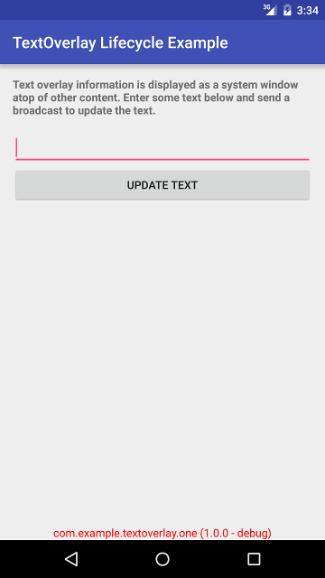
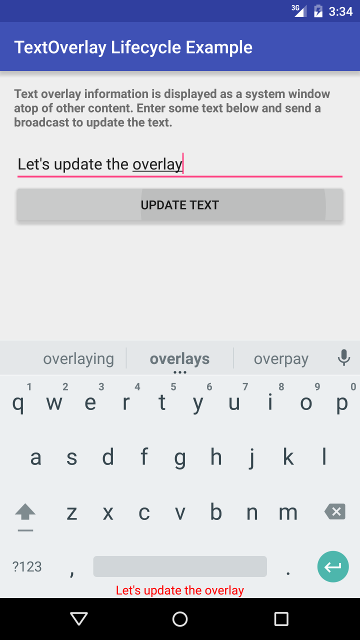

# TextOverlay
[  ](https://bintray.com/saschpe/maven/android-textoverlay/_latestVersion)
[](http://android-arsenal.com/details/1/3883)
[](http://www.apache.org/licenses/LICENSE-2.0.html)

This library provides a simple service that allows to display arbitrary text as a
system-window overlay.

It can be used to display debugging information in the debug build of your app so
that every screenshot that QA or beta testers do will automatically include the
product flavor or build type of your APK. You can provide additional information
such as the Git commit hash or arbitrary strings easily:




# Usage
You can start / stop the text overlay service the default way in your activities:

```java
@Override
protected void onStart() {
    super.onStart();
    startService(new Intent(this, TextOverlayService.class));
}

@Override
protected void onDestroy() {
    stopService(new Intent(this, TextOverlayService.class));
    super.onDestroy();
}
```

A more convenient way is to use the include activity lifecycle callbacks in your
app's application sub-class:

```java
public class Application extends android.app.Application {
    @Override
    public void onCreate() {
        super.onCreate();
        registerActivityLifecycleCallbacks(new TextOverlayActivityLifecycleCallbacks());
    }
}
```

Furthermore, you can declare the service in your *AndroidManifest.xml* to provide
additional parameters. This is entirely optional as the library will provide a
default declaration for you:

```xml
<service
    android:name=".service.TextOverlayService"
    android:exported="false" />
```

Either way, you have to declare the SYSTEM_ALERT_WINDOW permission in you manifest.
The library does not do that for you since you may only want to use the text overlay
service in specific flavors or build types:

```xml
<uses-permission android:name="android.permission.SYSTEM_ALERT_WINDOW" />
```

On API level 23 or later, you will have to ask the user to grant this permission.
However, the provided *TextOverlayActivityLifecycleCallbacks* will handle that for you.

Check out the provided example applications for different ways to use this library:
- textoverlay-activity-example
- textoverlay-lifecycle-example


# Download
```groovy
compile 'saschpe:textoverlay:1.0.5'
```

Snapshots of the development version are available in [Sonatype's `snapshots` repository][snap].


# License

    Copyright 2016 Sascha Peilicke

    Licensed under the Apache License, Version 2.0 (the "License");
    you may not use this file except in compliance with the License.
    You may obtain a copy of the License at

       http://www.apache.org/licenses/LICENSE-2.0

    Unless required by applicable law or agreed to in writing, software
    distributed under the License is distributed on an "AS IS" BASIS,
    WITHOUT WARRANTIES OR CONDITIONS OF ANY KIND, either express or implied.
    See the License for the specific language governing permissions and
    limitations under the License.


 [snap]: https://oss.sonatype.org/content/repositories/snapshots/
